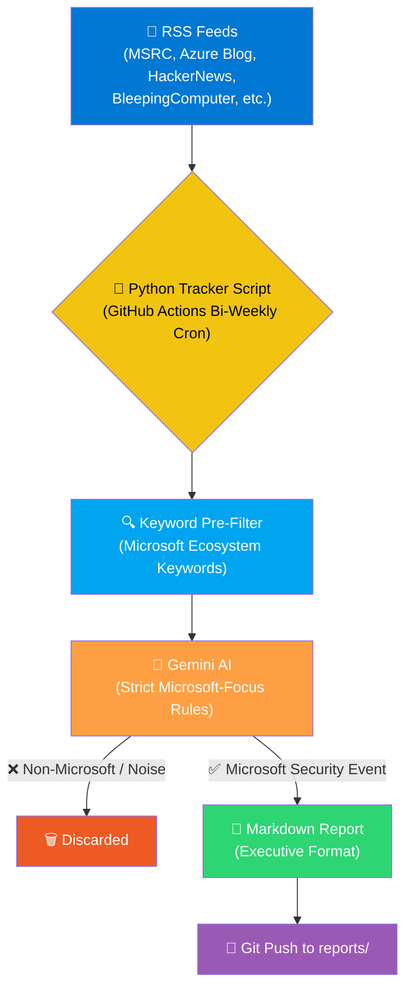

# 🔷 Microsoft Security — Weekly Threat Intel Tracker

> **Automated security intelligence pipeline focused on the Microsoft ecosystem, generating bi-weekly executive-ready briefings using Gemini AI and curated RSS feeds.**

[](https://github.com/Thomas-LEON/microsoft-threat-intel/actions)
[](https://www.python.org)
[](LICENSE)

---

## 🤔 The Problem

Security teams managing Microsoft-heavy environments face a constant stream of vulnerability disclosures, Patch Tuesday updates, Azure advisories, and Copilot-related security research. Keeping up with the security posture across Azure, M365, Entra ID, Copilot, Defender, Power Platform, and the broader Microsoft ecosystem is a full-time job.

## ✅ What It Does

This tool runs **twice a week** (Monday + Thursday), scrapes Microsoft-specific and general cybersecurity RSS feeds, and uses **Google Gemini AI** with strict Microsoft-focused business rules to filter noise and produce a structured **Executive Security Briefing**.

The Thursday run is strategically timed to capture **Patch Tuesday** disclosures (2nd Tuesday of each month).



---

## 🔷 Microsoft Coverage Scope

| Category | Products & Services Covered |
|---|---|
| **Cloud** | Azure (all services), Azure DevOps, AKS, Azure Functions, Azure OpenAI |
| **Identity** | Entra ID (Azure AD), AD FS, Conditional Access, MFA |
| **Productivity** | M365, Exchange, Outlook, SharePoint, OneDrive, Teams |
| **AI & Copilot** | M365 Copilot, GitHub Copilot, Security Copilot, Copilot Studio |
| **Security** | Defender (Endpoint, Cloud, Identity), Sentinel, Intune |
| **Platform** | Windows Server, Hyper-V, SQL Server, .NET, Power Platform |
| **Ecosystem** | NuGet, VS Code, Dynamics 365, Edge, Microsoft-signed drivers |

---

## 🛡️ AI Filtering & Quality Engine

The LLM is prompted with **strict business rules** to ensure high-quality, Microsoft-focused output:

| Inclusion Criteria (High Priority) | Exclusion Criteria (Noise) |
|---|---|
| **CVEs & Zero-Days** in Azure, M365, Windows Server, Exchange, etc. | Non-Microsoft incidents (AWS, GCP, Apple) |
| **Copilot & AI Security**: prompt injection, data leakage, plugin risks | Generic ransomware/phishing not targeting MS platforms |
| **Azure Cloud**: misconfigurations, identity attacks, storage exposure | Consumer Windows issues (gaming, home edition) |
| **Microsoft Supply Chain**: OAuth phishing, malicious marketplace apps | Old/recycled news outside the 7-day window |
| **Patch Tuesday**: monthly patches, actively exploited vulns | Product announcements with no security angle |
| **M365 Threats**: BEC via Outlook, Teams phishing, SharePoint exposure | |
| **Attacks ON Microsoft**: Midnight Blizzard, corporate breaches | |

---

## 📅 Schedule

| Day | Time (UTC) | Purpose |
|---|---|---|
| **Monday** | 07:00 | Weekly security recap (covers previous 7 days) |
| **Thursday** | 07:00 | Mid-week update (catches Patch Tuesday) |

Manual trigger is also available via `workflow_dispatch` in the GitHub Actions UI.

---

## 🚀 Quick Start

### 1. Clone the repository
```bash
git clone https://github.com/Thomas-LEON/microsoft-threat-intel.git
cd microsoft-threat-intel
```

### 2. Install dependencies
```bash
pip install -r requirements.txt
```

### 3. Set your API key
```bash
# Linux / macOS
export GEMINI_API_KEY="your-gemini-api-key"

# Windows (PowerShell)
$env:GEMINI_API_KEY = "your-gemini-api-key"
```

### 4. Run locally
```bash
python ms_threat_tracker.py
```

### 5. For GitHub Actions automation
Add `GEMINI_API_KEY` as a repository secret:
**Settings** → **Secrets and variables** → **Actions** → **New repository secret**

---

## 📂 Project Structure

```
microsoft-threat-intel/
├── .github/
│   └── workflows/
│       └── weekly-tracker.yml       # GitHub Actions bi-weekly cron
├── reports/
│   └── MS_Weekly_Security_*.md      # Generated reports (auto-committed)
├── ms_threat_tracker.py             # Main script (RSS + AI + report)
├── requirements.txt                 # Python dependencies
├── README.md                        # This file
└── LICENSE                          # MIT License
```

---

## 📊 Report Format

Each report includes:

- **🔢 Weekly Threat Score** (0-100) — Deterministic CRQ/FAIR calculation
- **📋 Auditable Metrics** — Threat Capability, Event Frequency, Business Impact (each /10)
- **📑 Structured Incidents** — Each with metadata, overview, technical details, impact analysis, recommended controls, and source footnotes

---

## 🔗 Related

- [Daily Threat Intel & Emerging Tech Tracker](https://github.com/Thomas-LEON/news-tracker) — Broader daily cybersecurity briefings for the financial sector
